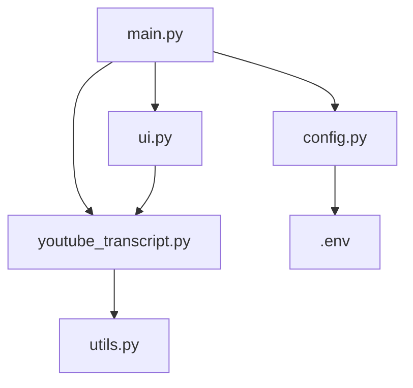

# POC 1 : Récupération et affichage des transcripts YouTube**
   - **Fonctionnalité :** Extraction automatique des transcripts à partir d'une URL YouTube
   - **Démonstration :** Interface permettant de saisir une URL YouTube et d'afficher le transcript correspondant

## Logique de l'architecture :

1. **main.py**
   - Rôle : Point d'entrée principal de l'application Streamlit.
   - Fonctionnalités :
     - Importe et initialise les composants nécessaires.
     - Définit la structure principale de l'interface utilisateur.
     - Gère le flux global de l'application.

2. **youtube_transcript.py**
   - Rôle : Gestion de toutes les opérations liées à l'extraction des transcripts YouTube.
   - Fonctionnalités :
     - Contient les fonctions pour extraire l'ID de la vidéo à partir de l'URL.
     - Implémente la logique d'extraction des transcripts en utilisant l'API YouTube Transcript.
     - Gère les erreurs spécifiques à l'extraction des transcripts.

3. **config.py**
   - Rôle : Gestion de la configuration de l'application.
   - Fonctionnalités :
     - Charge les variables d'environnement à partir du fichier .env.
     - Définit les constantes globales utilisées dans l'application.
     - Centralise la configuration pour faciliter les modifications futures.

4. **utils.py**
   - Rôle : Contient des fonctions utilitaires génériques.
   - Fonctionnalités :
     - Fournit des fonctions d'aide qui peuvent être utilisées dans différentes parties de l'application.
     - Peut inclure des fonctions de formatage, de validation, etc.

5. **ui.py**
   - Rôle : Contient les composants de l'interface utilisateur Streamlit.
   - Fonctionnalités :
     - Définit des fonctions pour créer et afficher différents éléments de l'interface utilisateur.
     - Sépare la logique de l'interface utilisateur du reste de l'application pour une meilleure organisation.

6. **.env**
   - Rôle : Stocke les variables d'environnement.
   - Fonctionnalités :
     - Contient des informations sensibles comme les clés API.
     - N'est pas versionné dans le système de contrôle de version pour des raisons de sécurité.

## Explication du fonctionnement :

1. L'utilisateur lance l'application via `main.py`.
2. `main.py` initialise l'interface utilisateur en utilisant les composants définis dans `ui.py`.
3. Lorsque l'utilisateur entre une URL YouTube, `main.py` appelle les fonctions de `youtube_transcript.py` pour extraire le transcript.
4. `youtube_transcript.py` utilise des fonctions utilitaires de `utils.py` si nécessaire.
5. La configuration globale et les variables d'environnement sont gérées par `config.py`, qui charge les données depuis le fichier `.env`.
6. Une fois le transcript extrait, `main.py` utilise à nouveau `ui.py` pour afficher les résultats à l'utilisateur.

Cette architecture permet une séparation claire des responsabilités, facilitant la maintenance et l'extension future du code. Elle rend également le projet plus accessible aux débutants en organisant logiquement les différentes parties de l'application.